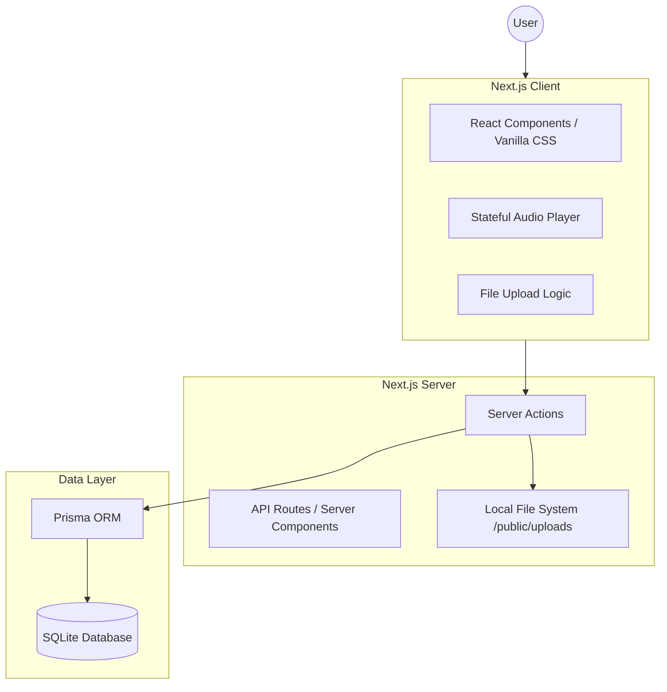
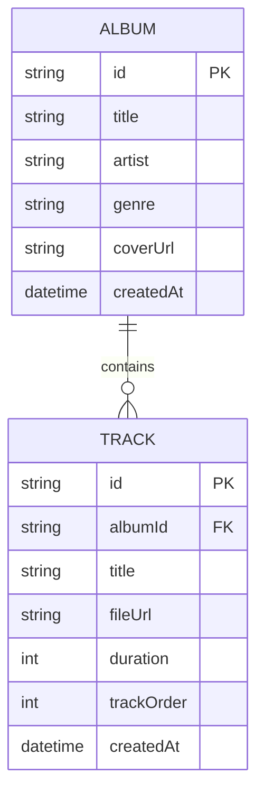
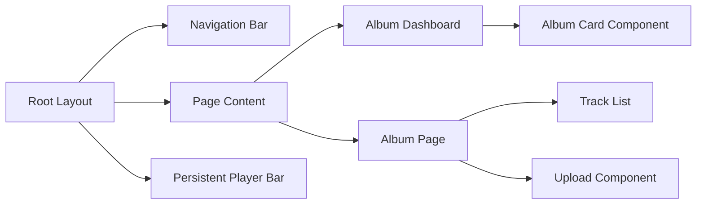
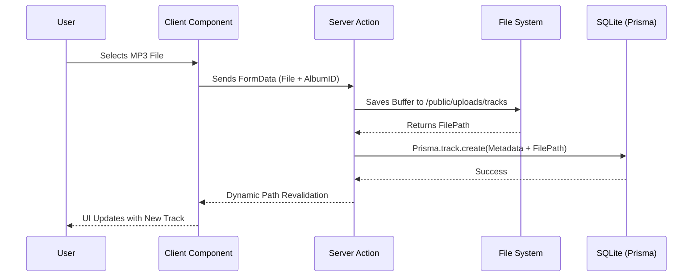

# MusicVault — Software Design Specification (SDS)

## 1. System Overview
**MusicVault** is a full-stack Next.js application that uses the App Router architecture. It manages music metadata in an SQLite database and stores binary files (MP3s and images) locally.

---

## 2. System Architecture

### 2.1 High-Level Architecture


---

## 3. Data Design (Database Schema)

We use a relational model to manage the link between albums and their constituent tracks.



---

## 4. Component Structure

The UI is organized for modularity and reusability, with a global player that persists across route changes.



---

## 5. Key Workflows (Sequence Diagrams)

### 5.1 Track Upload & Metadata Storage
This flow ensures that the file is physically saved before the database is updated.



---

## 6. API & Server Actions Interface

### 6.1 Server Actions
- `createAlbum(formData)`: Validates input, saves cover image, creates DB record.
- `uploadTrack(formData)`: Handles MP3 stream, extracts duration, links to `albumId`.
- `deleteTrack(id)`: Removes file from storage and entry from DB.
- `deleteAlbum(id)`: Cascades deletion of all associated tracks and files.

---

## 7. Audio Engine & Playback Logic

The audio player is a persistent, state-managed component that survives navigation using React Context.

### 7.1 Playback State Model
| State Key      | Type    | Purpose                                      |
|----------------|---------|----------------------------------------------|
| `currentTrack` | Object  | Metadata for the currently loading/playing MP3 |
| `isPlaying`    | Boolean | Toggle for playback status                  |
| `progress`     | Number  | Percentage of current track played          |
| `duration`     | Number  | Total duration of current track             |
| `queue`        | Array   | List of tracks from the current album       |

### 7.2 Playback Sequence Diagram
This diagram shows how the system handles a user selecting a track and the subsequent audio emission.

```mermaid
sequenceDiagram
    participant User
    participant UI as Track List Item
    participant Context as Audio Provider (State)
    participant Player as Persistent Player Bar
    participant HTML5 as HTML5 Audio API

    User->>UI: Clicks "Play" on Track
    UI->>Context: setTrack(trackData) + setIsPlaying(true)
    Context-->>Player: State Update Triggered
    Player->>HTML5: audio.src = trackPath; audio.play()
    loop Every 500ms
        HTML5->>Player: timeupdate event
        Player->>Context: setProgress(currentTime)
    end
    HTML5->>Context: onEnded event
    Context->>Context: playNextTrack()
```

---

## 8. Testing Strategy
This specification serves as the baseline for the future testing plan:
- **Unit Testing**: Testing the audio utility functions (time formatting, file validation).
- **Integration Testing**: Ensuring SQLite transactions complete correctly during heavy uploads.
- **End-to-End (E2E)**: Functional testing of the Player controls (play, pause, next) using a headless browser.
- **Visual Regression**: Ensuring the "Glassmorphism" effect remains consistent across screen sizes.
